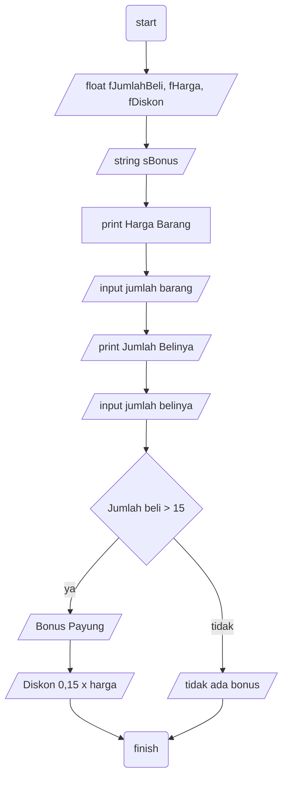

```mermaid 
    flowchart TD;
    A(start) --> B[/float fJumlahBeli, fHarga, fDiskon/];
    B --> C[/string sBonus/];
    C --> D[print Harga Barang];
    D --> E[/input jumlah barang/];
    E --> F[/print Jumlah Belinya/];
    F --> G[/input jumlah belinya/]
    G --> H{Jumlah beli > 15};
    H --ya-->I[/Bonus Payung/];
    I --> J[/Diskon 0,15 x harga/];
    H --tidak--> K[/tidak ada bonus/];
    J --> 0(finish)
    K --> 0
```